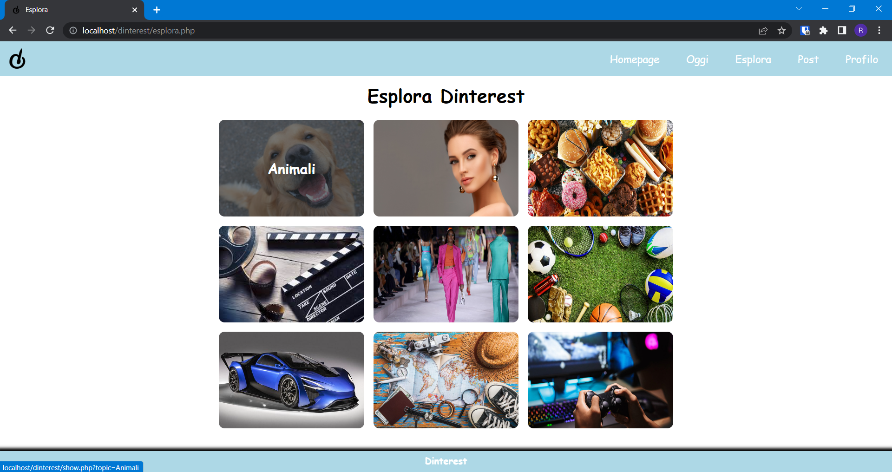

# Dinterest (WebSite)

## Descrizione della realtà di interesse
Il progetto realizzato è un sito web per la condivisione social di foto. 
Le funzionalità principali richieste per un sito web in tale ambito sono generalmente le seguenti: possibilità di pubblicare dei contenuti, effettuare delle ricerche per argomento, salvare delle immagini nel proprio profilo, interagire con altri utenti scambiando commenti e feedback sui contenuti postati, visualizzare un feed personalizzato di foto in base ai gusti dell’utente.

## Obiettivo del sito web
L’obiettivo del sito web è realizzare l’interazione tra utenti relativa ai contenuti postati, aspetto tipico dei siti social.

### Index 
 
E’ la prima pagina che si vede quando si accede al sito. Contiene uno slideshow e i pulsanti per la registrazione e il login. 

### Pagina di Login
 
La pagina permette di effettuare il login. Presenta un semplice form contenente i campi nome utente e password.

### Pagina di Registrazione
 
La pagina permette di effettuare la registrazione. Presenta un form contenente i campi e-mail, nome utente, password e offre la possibilità di scegliere tre topic tra i nove presenti.

### Pagina di Homepage
 
La sezione evidenzia un feed personalizzato di foto grazie alla scelta dei topic effettuata in fase di registrazione.

### Pagina di Esplora
 
L’utente può scegliere una delle 9 tematiche e visualizzare le foto postate relative a quel determinato argomento.

### Pagina di Oggi
 
Mostra le foto pubblicate nella data odierna.

### Nuovo Post
 
L’utente puo’ scegliere delle immagini da caricare e pubblicarle.

### Pagina di Profilo - Foto Salvate
 
Permette di effettuare il logout tramite apposito pulsante, visualizzare le foto salvate e le foto postate. Si è scelto di default di far visualizzare le foto salvate, in quanto solitamente in numero maggiore rispetto alle foto postate. Lo switch tra le foto salvate e postate è realizzato graficamente tramite l’evidenziazione del bottone.

### Pagina di Profilo - Foto Postate
 
